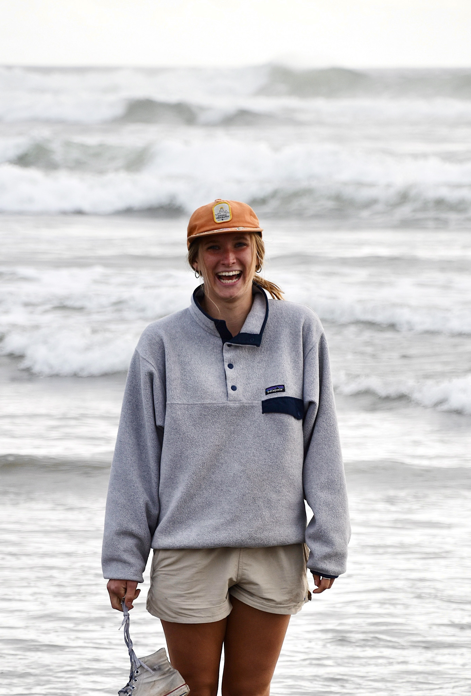

{width="300px"}

---
title: "Audrey Lillie"
---

Recent graduate from the University of Oregon (2026). BS: Marine Biology, BS: Spatial Data Science, Clark Honors College, Sutherland Lab.

My interests include:

-   Marine science: planktonic surface distribution and surface properties, marine birds & mammals, estuarine ecology, invertebrate zoology
-   Spatial analysis (GIS, R): remote sensing, demographic geography, machine learning, climate data analysis, disaster response, change detection

## About

I graduated from the University of Oregon in Spring 2026 with two Bachelors of Science degrees in Marine Biology and Spatial Data Science, and a certificate from the Clark Honors College.

Currently, I work under Dr. Kelly Sutherland in her lab "Form, Function, and Flow in the Plankton," researching the zooplanktonic phylum Chaetognatha and their reproductive and morphological distribution in the Northern California Current.

## Research Interests

Currently, I work under Dr. Kelly Sutherland in her lab "Form, Function, and Flow in the Plankton," researching the zooplanktonic phylum Chaetognatha and their reproductive and morphological distribution in the Northern California Current.

My long-term research interests reflect my education: I want to work with ecosystems (even if not marine) and conserving them. If I could create my own dream job, I would map wide areas of coral reefs, study them, quantify them, and save them.
